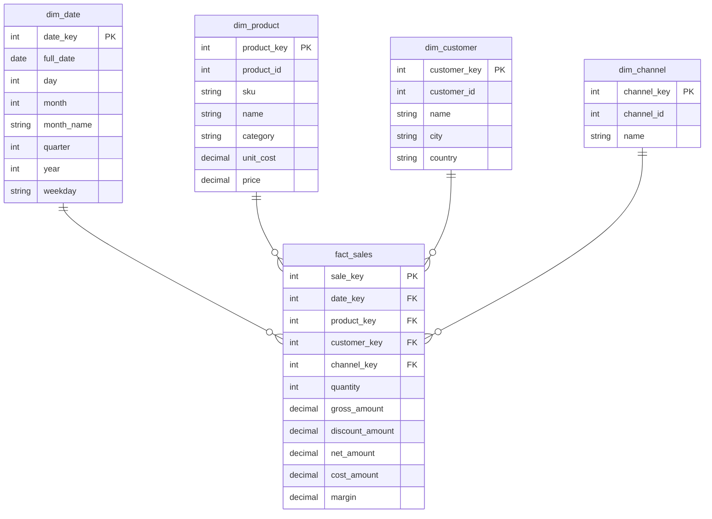

# E-Commerce OLTP -> OLAP ETL Pipeline

A small, self-contained data engineering portfolio project. It generates a
synthetic e-commerce database in the style of a real OLTP system, then runs
an ETL pipeline that extracts, transforms and loads that data into an
analytical data warehouse (star schema) built with DuckDB.

The goal of this project is to demonstrate, in plain readable Python, the
core ideas behind data warehousing: normalization vs. denormalization,
OLTP vs. OLAP, star schemas, surrogate keys, transactions/ACID, and basic
parallelism for I/O-bound work.

## OLTP vs. OLAP

| | OLTP (source) | OLAP (warehouse) |
|---|---|---|
| Purpose | Run the day-to-day store (create orders, add customers) | Analyze historical sales |
| Engine | SQLite | DuckDB |
| Schema | Normalized (3NF) - `categories`, `channels`, `customers`, `products`, `orders`, `order_items` | Star schema - `dim_date`, `dim_product`, `dim_customer`, `dim_channel`, `fact_sales` |
| Data shape | Many small related tables, no repeated data | Few wide tables, some data intentionally repeated (denormalized) |
| Typical query | "Insert one new order" | "Total revenue by category and month" |
| Optimized for | Fast, safe writes of single records | Fast aggregation over millions of rows |

## Star schema



`fact_sales` has one row per order item (its grain). `dim_product.category`
is denormalized: it is pulled in from the OLTP `categories` table during
the transform step, so analytical queries never need to join a separate
category table.

## The pipeline

```
data/generate_data.py          src/pipeline.py
  (stdlib only)          -->     Extract  -->  Transform  -->  Load
        |                          |               |             |
   data/oltp.sqlite          reads SQLite    builds star      writes
   data/csv/*.csv            into pandas     schema in        warehouse.duckdb
                              DataFrames      pandas           in one
                              (in parallel                     transaction,
                              via threads)                     then indexes
```

1. **Generate** (`data/generate_data.py`) - builds a fresh, normalized
   SQLite database of customers, products, orders and order items, using
   only the Python standard library. Also exports each table to CSV.
2. **Extract** (`src/extract.py`) - the `Extractor` class reads all six
   OLTP tables into pandas DataFrames. `extract_all()` reads them
   concurrently with `ThreadPoolExecutor`, since reading from a database is
   I/O-bound (see the docstring in that file for why threads help there
   despite the GIL).
3. **Transform** (`src/transform.py`) - the `Transformer` class builds the
   four dimension tables (assigning surrogate keys, denormalizing category
   onto products) and the fact table (joining in surrogate keys, computing
   `gross_amount`, `discount_amount`, `net_amount`, `cost_amount`,
   `margin`). Only orders with status `completed` are counted as sales.
4. **Load** (`src/load.py`) - the `Loader` class creates the warehouse
   schema in DuckDB and loads every table inside a single transaction
   (`BEGIN` / `COMMIT` / `ROLLBACK`), so the warehouse is never left
   half-updated. Indexes on `fact_sales`' foreign key columns are created
   afterwards, once, instead of being maintained on every row insert.

## Tech stack

- **Python 3** - standard library only for the data generator
- **pandas** - extract and transform
- **DuckDB** - the analytical warehouse (OLAP, columnar, SQL)
- **SQLite** - the OLTP source database

## Repository structure

```
data/
  generate_data.py       synthetic OLTP data generator (stdlib only)
sql/
  oltp_schema.sql         OLTP DDL (reference)
  warehouse_schema.sql    star schema DDL, executed by src/load.py
  analytics_queries.sql   example OLAP queries
src/
  config.py               paths and settings
  models.py                dataclasses describing each warehouse row
  extract.py               Extractor: OLTP -> pandas DataFrames
  transform.py              Transformer: DataFrames -> star schema
  load.py                   Loader: DataFrames -> DuckDB (transaction + indexes)
  pipeline.py               runs Extract -> Transform -> Load
  export_powerbi.py         exports the warehouse to Parquet for Power BI
  ai_insights.py            asks Claude to summarize the analytics queries
  generate_charts.py        renders the charts embedded below
docs/
  images/                 chart PNGs embedded in this README
powerbi_export/           Parquet export (generated, gitignored)
insights/                 AI-written summaries (generated, gitignored)
requirements.txt
```

## Quick start

```bash
python3 -m venv .venv
source .venv/bin/activate        # Windows: .venv\Scripts\activate
pip install -r requirements.txt

# 1. Generate the synthetic OLTP database
python -m data.generate_data

# 2. Run the ETL pipeline (OLTP SQLite -> OLAP DuckDB)
python -m src.pipeline

# 3. Explore the warehouse
python3 -c "import duckdb; duckdb.connect('warehouse.duckdb').sql('SELECT * FROM fact_sales LIMIT 5').show()"
# or open sql/analytics_queries.sql and run individual queries against warehouse.duckdb

# 4. (optional) Get an AI-written summary of the analytics queries
export ANTHROPIC_API_KEY=your-key-here   # from console.anthropic.com
python -m src.ai_insights
```

Step 4 runs every query in `sql/analytics_queries.sql`, sends the results to
Claude, and asks for a short plain-English summary of trends, best/worst
performers, and anomalies. The summary is printed to the terminal and saved
to `insights/summary_<date>.md`. If `ANTHROPIC_API_KEY` isn't set, it exits
with a clear message instead of crashing - the rest of the pipeline doesn't
depend on this step.

## Power BI Dashboard

The warehouse loads straight into Power BI Desktop as a set of Parquet
files - no direct DuckDB connector needed. The finished report has four
pages: an overview with KPI cards and a revenue trend, plus dedicated
pages for products, sales channels, and customers/geography.

The finished report is in [`powerbi/ecommerce-dashboard.pbix`](powerbi/ecommerce-dashboard.pbix)
- open it in Power BI Desktop (free) to explore it live, including the DAX
measures and page relationships.

**Overview**


**Products**


**Channels**


**Customers**


### Rebuilding it

1. Run the pipeline, then export the warehouse to Parquet:
   ```bash
   python -m src.pipeline
   python -m src.export_powerbi
   ```
   This writes one `.parquet` file per table into `powerbi_export/`
   (`dim_date.parquet`, `dim_product.parquet`, `dim_customer.parquet`,
   `dim_channel.parquet`, `fact_sales.parquet`).
2. Open **Power BI Desktop** -> **Get Data** -> **Parquet**, and load each
   of the five files.
3. Go to the **Model** view and connect `fact_sales` to each dimension on
   its key column (`date_key`, `product_key`, `customer_key`,
   `channel_key`) - same shape as the star schema diagram above. Power BI
   usually detects these automatically from the matching column names.
4. Add four measures on `fact_sales` (right-click the table -> New measure):
   ```dax
   Total Revenue = SUM(fact_sales[net_amount])
   Total Margin = SUM(fact_sales[margin])
   Margin % = DIVIDE([Total Margin], [Total Revenue])
   Total Units = SUM(fact_sales[quantity])
   ```
5. Build the four pages:
   - **Overview** - the 4 measures as cards, a line chart of revenue by
     month (`dim_date.year` + `month` on the X-axis), and slicers on
     `dim_date.year` and `dim_channel.name`
   - **Products** - top 10 products by revenue, and revenue/margin by
     category
   - **Channels** - margin by channel, and a revenue trend per channel
     (`dim_channel.name` on the Legend)
   - **Customers** - revenue by country, and a table of the top 5
     customers by lifetime revenue - filter Top N on `customer_id`, not
     `name`, since names aren't guaranteed unique in the synthetic data
   - Sync the two slicers across all four pages (View -> Sync slicers) so
     filtering on Overview affects the rest of the report

Re-run the pipeline and export any time the underlying data changes, then
hit **Refresh** in Power BI to pick up the new Parquet files.

## Example analytical questions this warehouse answers

See `sql/analytics_queries.sql` for the full, runnable versions:

- What is total revenue and margin per sales channel, per month?
- Which 10 products generate the most revenue?
- What is the average order value per country?
- How does revenue trend quarter over quarter?
- Which product category has the best profit margin?
- Who are the top 5 customers by lifetime revenue?

Two of them, charted straight from a real pipeline run:


Regenerate these after any pipeline run with:
```bash
python -m src.generate_charts
```
