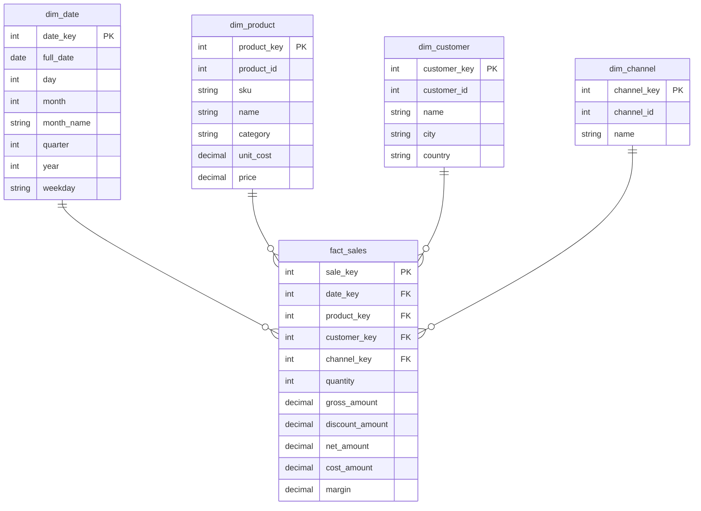
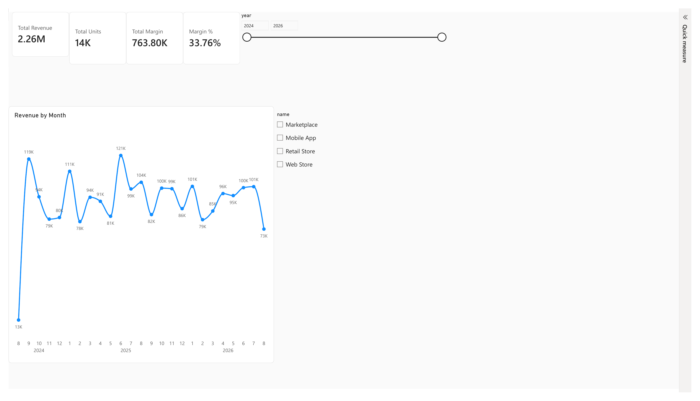
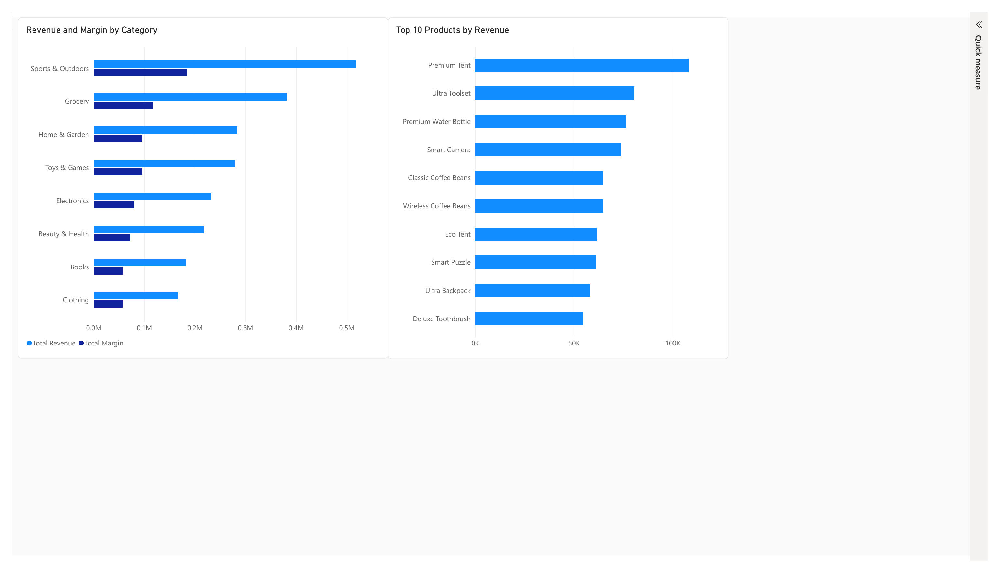
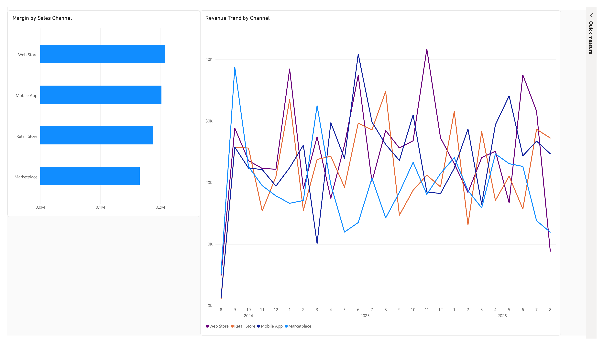
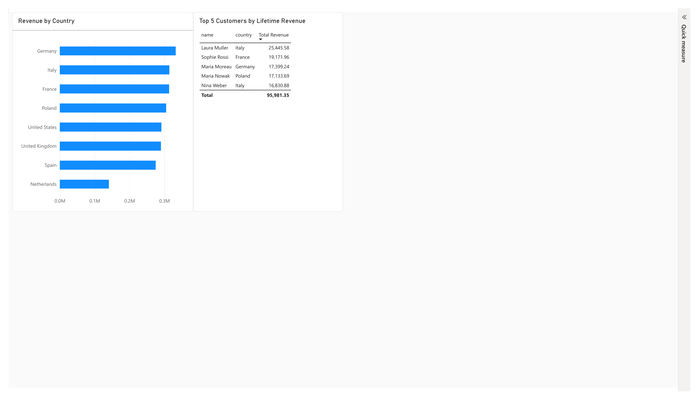
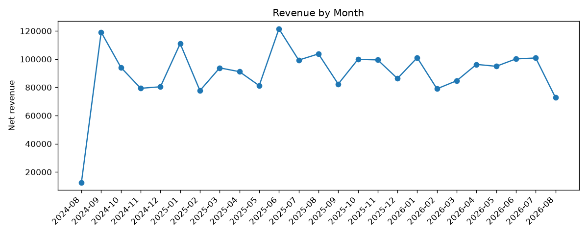
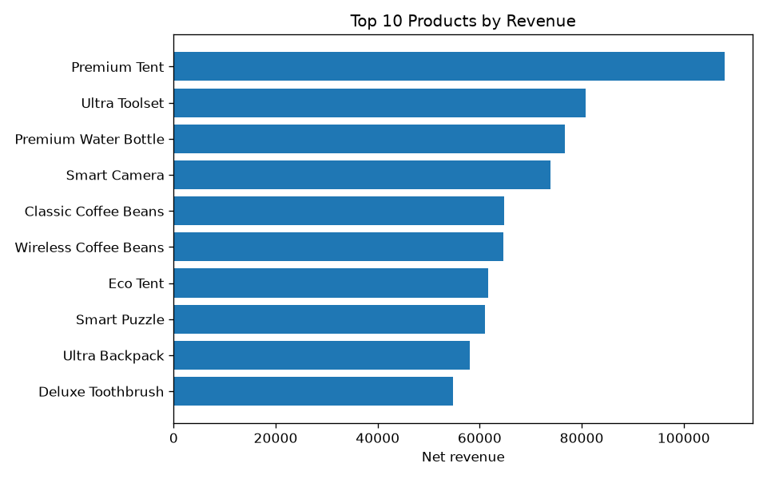

# E-Commerce OLTP -> OLAP ETL Pipeline

I built this while putting together a portfolio for data/BI internship
applications. The idea: take a normal online-store database - the kind
that just records orders one at a time - and turn it into something you
can actually run analytics on, then put a real dashboard on top of it in
Power BI.

There's no real company or real data behind this. I wrote a small
generator that spits out a fake but reasonably realistic e-commerce
dataset (customers, products, orders, order items), so I'd have something
to work with without needing an actual business's data.

## Why there are two databases here, not one

The source database (SQLite) is normalized - every category name, every
customer, every product lives in exactly one place, and other tables just
point to it by ID. That's how you want a database that's constantly
handling new orders: fast, safe writes, no duplicated data to keep in
sync.

The warehouse (DuckDB) is the opposite on purpose. It's built for reading,
not writing - specifically for aggregating over lots of rows at once
("what did we sell last quarter by category?"). To make that fast and
easy to query, data gets deliberately duplicated - a product's category
name gets copied right onto the product row instead of making every query
join back to a categories table.

| | OLTP (SQLite) | OLAP (DuckDB) |
|---|---|---|
| Job | record orders as they happen | answer questions about sales history |
| Shape | normalized, lots of small tables | star schema, few wide tables |
| Typical query | insert one order | sum revenue by month and channel |

## The star schema



One row in `fact_sales` = one order item. That `category` field on
`dim_product` is the denormalized bit I mentioned above - it gets pulled
in from the OLTP `categories` table during the transform step.

## How the pipeline actually runs

1. **[`data/generate_data.py`](data/generate_data.py)** builds the fake
   OLTP database from scratch - stdlib only, no pandas. It also dumps
   everything to CSV, mostly so I could eyeball the raw data in a
   spreadsheet while debugging.
2. **[`src/extract.py`](src/extract.py)** pulls all six OLTP tables into
   pandas. The `extract_all()` method reads them concurrently with a
   thread pool, which actually helps here - reading from a database is
   mostly waiting on I/O, not CPU work, so Python's GIL doesn't get in
   the way the way it would for something CPU-bound.
3. **[`src/transform.py`](src/transform.py)** builds the four dimension
   tables (giving each row a surrogate key, gluing the category name
   onto products) and the fact table, computing `gross_amount`,
   `discount_amount`, `net_amount`, `cost_amount`, and `margin` for every
   line item. Only `completed` orders count - cancelled and pending ones
   get filtered out here.
4. **[`src/load.py`](src/load.py)** writes everything into DuckDB inside
   a single transaction, so a failed load can't leave the warehouse
   half-updated. Indexes on the fact table's foreign keys get built
   after the data is in, not before - building them first would mean
   paying the index-update cost on every single row insert instead of
   once at the end.

The code itself is kept pretty bare on comments - the reasoning above is
the "why", the files themselves are short enough to just read for the
"how". `src/transform.py` in particular is worth a look if you want to
see the actual pandas merges behind the star schema.

## Why these tools

I used **DuckDB** for the warehouse mainly because I wanted to try a
proper columnar/analytical engine without needing to spin up a server -
it's basically SQLite's philosophy (single file, zero setup) applied to
OLAP instead of OLTP. **SQLite** felt like the obvious pick for the
source side for the same reason: no server to configure, just a file.
**pandas** does the actual data shuffling in the extract/transform steps
because writing that by hand in raw SQL would've been a lot more code for
the same result.

## Repo layout

```
data/
  generate_data.py       synthetic OLTP data generator (stdlib only)
sql/
  oltp_schema.sql         OLTP DDL, for reference
  warehouse_schema.sql    star schema DDL, run by src/load.py
  analytics_queries.sql   example OLAP queries
src/
  config.py               paths and settings
  models.py                dataclasses describing each warehouse row
  extract.py               Extractor: OLTP -> pandas DataFrames
  transform.py              Transformer: DataFrames -> star schema
  load.py                   Loader: DataFrames -> DuckDB (transaction + indexes)
  pipeline.py               runs Extract -> Transform -> Load
  export_powerbi.py         exports the warehouse to Parquet for Power BI
  ai_insights.py            asks Claude to summarize the analytics queries
  generate_charts.py        renders the charts embedded below
powerbi/
  ecommerce-dashboard.pbix  the actual Power BI report
docs/
  images/                 screenshots and chart PNGs used in this README
powerbi_export/           Parquet export (generated, gitignored)
insights/                 AI-written summaries (generated, gitignored)
requirements.txt
```

## Running it yourself

```bash
python3 -m venv .venv
source .venv/bin/activate        # Windows: .venv\Scripts\activate
pip install -r requirements.txt

# 1. generate the fake OLTP database
python -m data.generate_data

# 2. run the ETL pipeline (SQLite -> DuckDB)
python -m src.pipeline

# 3. poke at the warehouse
python3 -c "import duckdb; duckdb.connect('warehouse.duckdb').sql('SELECT * FROM fact_sales LIMIT 5').show()"
# or open sql/analytics_queries.sql and run the queries in there directly

# 4. optional: get an AI-written summary of the analytics queries
export ANTHROPIC_API_KEY=your-key-here   # from console.anthropic.com
python -m src.ai_insights
```

That last step sends the results of every query in `sql/analytics_queries.sql`
to Claude and asks for a short summary - trends, best/worst performers,
anything that looks off. It prints the summary and saves it to
`insights/summary_<date>.md`. If you don't have an API key set it just
exits with a message instead of blowing up - the rest of the pipeline
doesn't need it.

## The Power BI dashboard

I ended up building four pages instead of cramming everything onto one -
it got messy fast otherwise. There's an overview page with a few KPI
cards and a revenue trend, and then separate pages for products, sales
channels, and customers/geography, with the year and channel filters
synced across all of them so picking a year once on the overview actually
filters the other pages too.

The actual report file is in
[`powerbi/ecommerce-dashboard.pbix`](powerbi/ecommerce-dashboard.pbix) -
open it in Power BI Desktop (it's free) to poke around the DAX measures
and the model directly.

**Overview**


**Products**


**Channels**


**Customers**


### Rebuilding it from scratch

1. Run the pipeline, then export it to Parquet:
   ```bash
   python -m src.pipeline
   python -m src.export_powerbi
   ```
   This drops one `.parquet` file per table into `powerbi_export/`.
2. In Power BI Desktop: **Get Data -> Parquet**, and load all five files
   one at a time.
3. Switch to the **Model** view and check that `fact_sales` is connected
   to each dimension on its key column (`date_key`, `product_key`,
   `customer_key`, `channel_key`). Power BI usually figures these out on
   its own since the column names match on both sides.
4. Add four measures on `fact_sales` (right-click it -> New measure):
   ```dax
   Total Revenue = SUM(fact_sales[net_amount])
   Total Margin = SUM(fact_sales[margin])
   Margin % = DIVIDE([Total Margin], [Total Revenue])
   Total Units = SUM(fact_sales[quantity])
   ```
5. Build the pages:
   - **Overview** - the four measures as cards, a line chart of revenue
     by month, and slicers on `dim_date.year` and `dim_channel.name`
   - **Products** - top 10 products by revenue, plus revenue/margin per
     category
   - **Channels** - margin by channel, plus a revenue trend with channel
     on the legend
   - **Customers** - revenue by country, plus a table of the top 5
     customers by lifetime revenue
   - Sync the two slicers across all four pages (View -> Sync slicers)

A couple of things tripped me up while building this that are worth
knowing if you're doing the same thing: Power BI sometimes sorts a new
chart's axis by value instead of by date, which makes a perfectly normal
trend line look like nonsense until you fix it under "Sort axis". And
filtering a "top N customers" table by name doesn't work if two different
customers happen to share a name (which happens here, since the fake data
generator only has ~20 first and last names to pick from) - filter on
`customer_id` instead, since that's guaranteed unique.

Re-run the pipeline and export whenever the underlying data changes, then
hit Refresh in Power BI to pick up the new files.

## Questions this warehouse can answer

Full queries are in `sql/analytics_queries.sql`:

- Revenue and margin per sales channel, per month
- Which 10 products bring in the most revenue
- Average order value per country
- Quarter-over-quarter revenue trend
- Which product category has the best margin
- Top 5 customers by lifetime revenue

Two of them, charted from an actual pipeline run:





Regenerate these with:
```bash
python -m src.generate_charts
```
